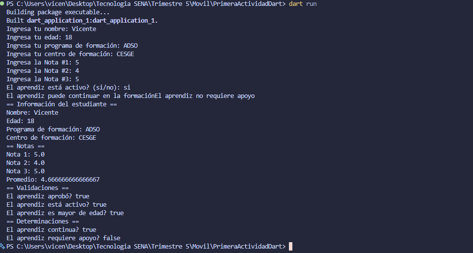

# Primera Actividad Dart

## 1. Nombre del aprendiz
Vicente Rios

## 2. Número de ficha
3256538

## 3. Programa de formación
Análisis y Desarrollo de Software (ADSO)

## 4. Descripción del proyecto
Aplicación de línea de comandos desarrollada en Dart que registra la información básica de un aprendiz (nombre, edad, programa y centro de formación), captura tres notas, calcula el promedio y realiza una serie de validaciones sobre el estado académico del aprendiz, mostrando finalmente un resumen completo de los resultados en la consola.

## 5. Objetivo de la actividad
Aplicar los conceptos fundamentales del lenguaje Dart (entrada y salida de datos por consola, tipos de datos, operadores, estructuras condicionales y variables) mediante la construcción de un programa que gestione y valide la información académica de un aprendiz.

## 6. Temas trabajados
- Entrada y salida de datos por consola (`stdin`/`stdout`).
- Conversión de tipos de datos (`String` a `int` y `double`).
- Declaración y uso de variables.
- Operadores aritméticos (cálculo del promedio).
- Estructuras condicionales (`if` / `else`).
- Operadores lógicos (`&&`).
- Interpolación de cadenas (`String interpolation`).
- Impresión de resultados formateados con `print()`.

## 7. Instrucciones para ejecutar el programa
1. Tener instalado el [SDK de Dart](https://dart.dev/get-dart) (versión `^3.12.2` o superior).
2. Clonar o descargar este repositorio.
3. Abrir una terminal en la carpeta del proyecto `PrimeraActividadDart`.
4. Instalar las dependencias del proyecto:
   ```
   dart pub get
   ```
5. Ejecutar el programa:
   ```
   dart run bin/dart_application_1.dart
   ```
6. Ingresar los datos solicitados por consola en el siguiente orden:
   - Nombre del aprendiz.
   - Edad.
   - Programa de formación.
   - Centro de formación.
   - Nota 1, Nota 2 y Nota 3.
   - Estado de actividad (si/no).
7. Revisar el resumen de resultados que se muestra en la consola.

## 8. Evidencia de ejecución
La evidencia de ejecución del programa se encuentra en la carpeta [`evidencias`](evidencias/EvidenciaPrograma.png).



## 9. Preguntas de reflexión
**¿Por qué es importante validar los datos de entrada en un programa?**
Porque evita errores en tiempo de ejecución y garantiza que la información procesada sea consistente y confiable, previniendo fallos como excepciones al convertir tipos de datos inválidos.

**¿Qué ventajas ofrece Dart para el manejo de tipos de datos frente a otros lenguajes?**
Dart permite tanto tipado estático como dinámico, ofrece null safety para prevenir errores por valores nulos, y cuenta con métodos integrados para la conversión de tipos de forma sencilla y segura.

**¿Cómo aporta este ejercicio al desarrollo de aplicaciones móviles?**
Dart es el lenguaje base de Flutter, por lo que comprender su sintaxis, el manejo de variables, condicionales y entrada/salida de datos es un primer paso fundamental para construir la lógica de aplicaciones móviles más adelante.

## 10. Conclusión de la actividad
El desarrollo de esta actividad permitió reforzar los fundamentos del lenguaje Dart mediante un caso práctico y cercano al contexto de formación del aprendiz. Se logró comprender el manejo de variables, la captura y validación de datos por consola, el uso de estructuras condicionales y la generación de reportes en consola, sentando las bases necesarias para abordar temas más avanzados en el desarrollo de aplicaciones móviles con Flutter.
